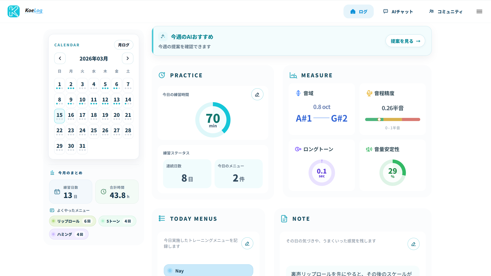
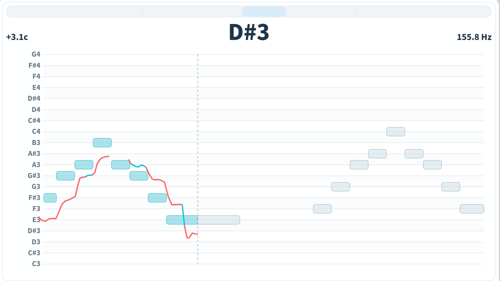
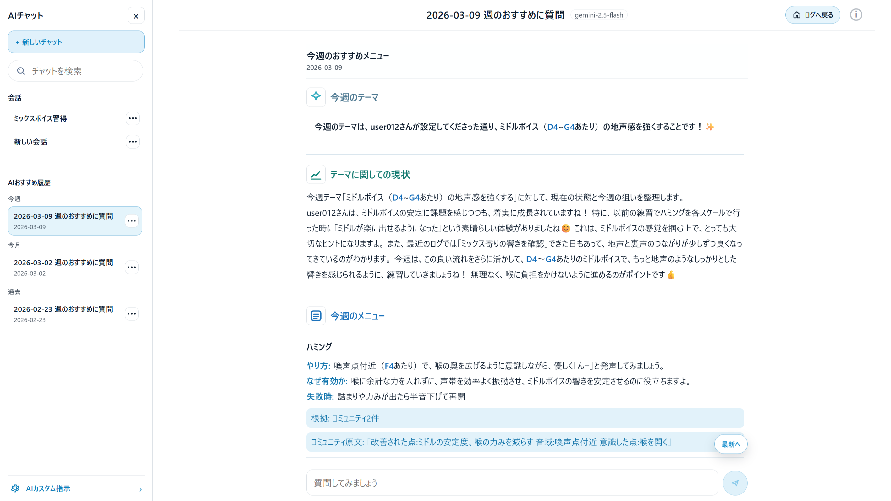
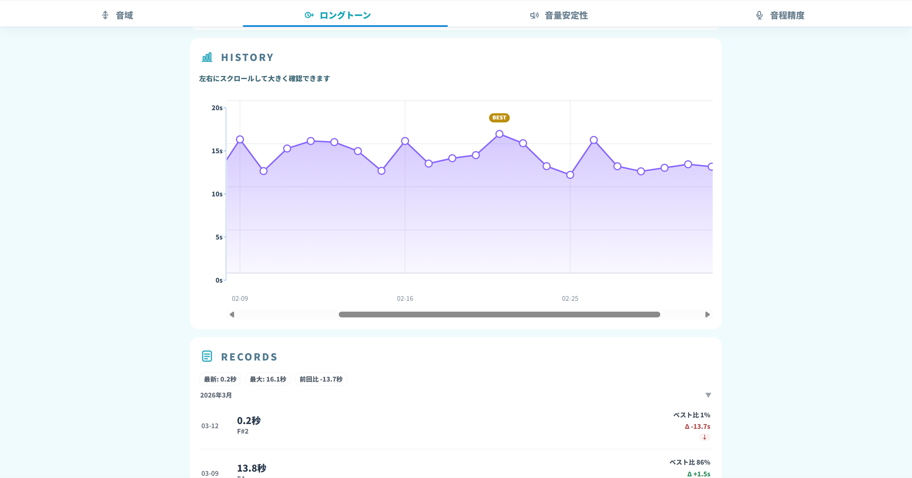
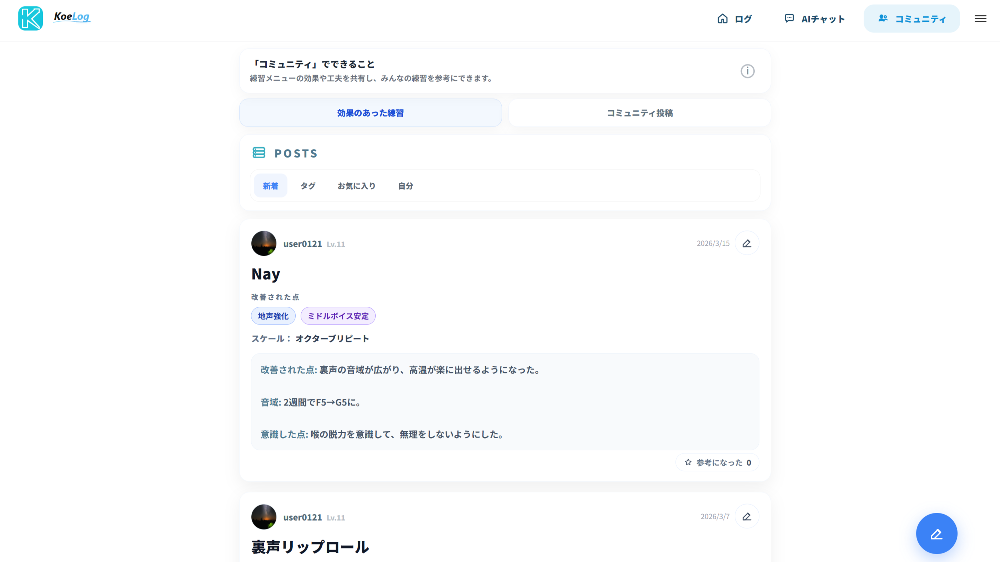
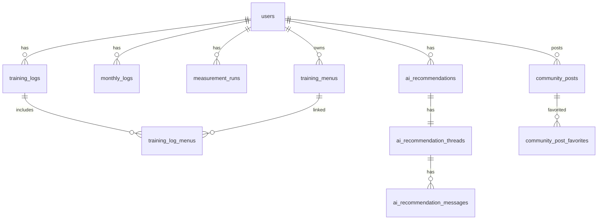
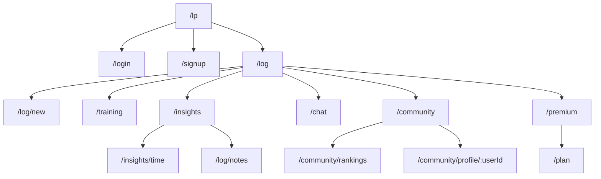

# Koelogs

## サイトリンク

- 公開ページ: https://koelogs-frontend-vgkk.onrender.com/lp

## ゲストログイン

上記リンク先の LP から、ログイン不要でゲストユーザーとして画面を試せます。  
まずは `ゲストで試す` から、ログページ・分析ページ・コミュニティの雰囲気を確認できます。

## サービス概要・開発背景

Koelogs は、AI がボイストレーニングの練習記録と音声測定を分析し、次に取り組むべき練習メニューを提案する Web アプリです。

自分自身がボイトレを続ける中で、

- 練習内容を振り返りにくい
- 成長を数値で見づらい
- 次に何をやるべきか迷いやすい

という課題を感じたことが開発のきっかけでした。

単なる記録アプリではなく、

- 日々の練習ログ
- 録音測定による数値化
- AI による提案
- 他ユーザーの実践知を活用するコミュニティ

を 1 つにつないで、継続しやすいボイトレ体験を作ることを目指しています。

## メイン機能

### 1. ログ記録

日々の練習時間・練習メニュー・メモを記録できます。  
週単位の AI おすすめや、月単位の振り返りにもつながる、このアプリの中心機能です。

### 2. 録音測定

`音域 / ロングトーン / 音量安定性 / 音程精度` の 4 種類を測定できます。  
録音データをそのまま保存するのではなく、測定結果を記録して推移を見られるようにしています。

### 3. AIおすすめ・AIチャット

直近の練習ログや測定結果をもとに、AI がその週の練習メニューを提案します。  
提案内容をもとに、そのまま AI チャットで相談や深掘りもできます。

### 4. 分析ページ

測定結果の推移を可視化し、単発ではなく中長期の変化を確認できます。  
CSV 出力にも対応し、自分の練習履歴を後から見返しやすくしています。

### 5. コミュニティ

練習メニューの効果や実践レポートを共有できます。  
コミュニティの投稿データは、AIおすすめの補助根拠としても活用しています。

## 使用技術

### Backend

- Ruby on Rails 8.1 (API mode)
- PostgreSQL
- Cookie Session 認証

### Frontend

- React 19
- TypeScript (strict)
- Vite
- React Router

### その他

- Gemini 2.5 Flash
- Stripe
- Google Login
- Render

## 品質向上の取り組み

### テスト・CI

- Rails の Minitest を活かして、認証・課金など高リスク領域を中心にテストを整備
- frontend には Vitest を導入
- GitHub Actions で lint / security check / test を自動実行

### セキュリティ

- `has_secure_password` によるパスワード管理
- メール確認・ログインロック・トークン有効期限
- rate limit の導入
- production の security headers / host 制限の整備

### パフォーマンス

- production build でボトルネックを確認
- route-level lazy loading を導入
- 初回 bundle を削減し、初回表示の体感速度を改善

## ER図

## 画面遷移図

## 工夫した点

### 1. AIおすすめを「提案だけ」で終わらせない構成

AI が週のおすすめメニューを出すだけでなく、その内容をそのまま AI チャットで深掘りできるようにしました。  
提案と会話を分断せず、実際の練習に落とし込みやすい設計にしています。

### 2. 録音データではなく「測定結果」を資産にする設計

録音ファイルをただ保存するのではなく、`音域 / ロングトーン / 音量安定性 / 音程精度` を数値として蓄積し、変化を追える形にしています。  
日々の練習が「記録」と「分析」の両方につながるようにしました。

### 3. 継続しやすさを意識した導線設計

初回ログイン時のビギナーミッション、ログページ中心の導線、AIおすすめ未生成時の案内など、迷いにくい導線を細かく整えました。

### 4. コミュニティを AI の補助根拠として活用

コミュニティ投稿を単なる掲示板で終わらせず、AIおすすめの補助根拠として使うことで、個人ログだけでは足りない実践知を取り込める構成にしています。

## 今後追加したい機能

- 独自ドメイン反映後の公開最適化
- 分析 / 監視基盤の導入と、公開後の改善サイクル運用
- 月ログ比較や AI 診断のさらなる改善
- モバイル体験の磨き込み
- コミュニティ機能の拡張
