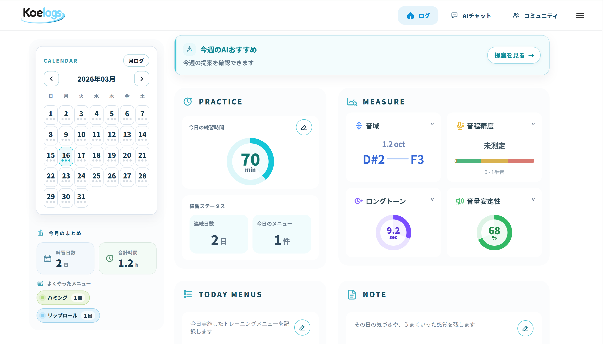
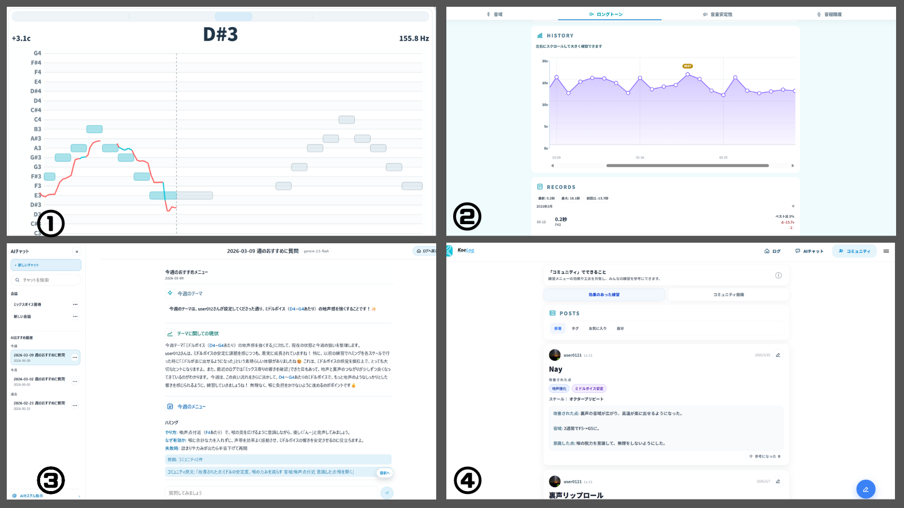
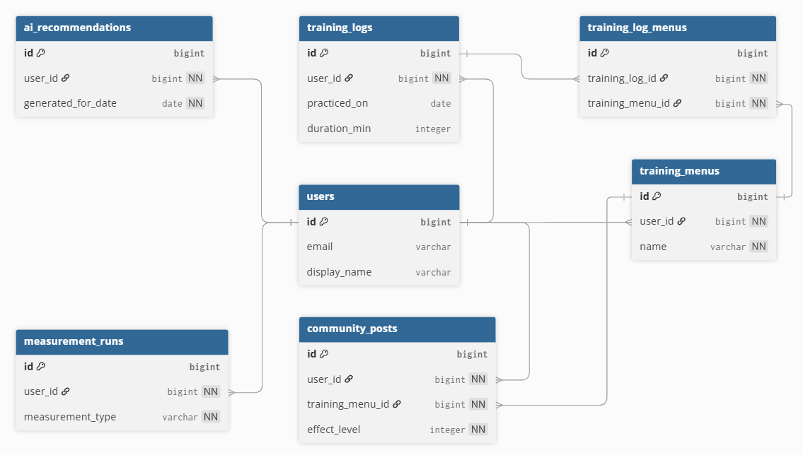

# Koelogs
公開ページ: https://koelogs-frontend-vgkk.onrender.com/lp

## ゲストログイン

上記リンク先の LP から、ログイン不要でゲストユーザーとして画面を試せます。  
また、デモ用アカウントでも確認できます。  
- Email: `koelogs.app@gmail.com`
- Password: `password`

## サービス概要・開発背景

Koelogs は、ボイストレーニングの記録・音声測定・AI 提案を一つにつないだ Web アプリです。

自分自身がボイトレを続ける中で、練習を振り返りにくく、次に何をやるべきか分かりにくいという課題を感じたことが開発のきっかけでした。そのため、日々のトレーニングの記録、AIによるメニュー提案を一つのアプリ内で完結できるように設計しました。

特徴は、コミュニティでのユーザー投稿から蓄積される実践知を AI 提案に活用できることです。掲示板のように知識が流れて終わるのではなく、「効果のあった練習データ」を蓄積し、集合知として次のユーザーの練習提案に生かせる設計にしています。


## メイン機能



-  ①録音測定 ：
  `音域 / ロングトーン / 音量安定性 / 音程精度` を測定し、数値で確認することが出来ます。
- ②分析ページ：
  測定結果の推移をグラフで可視化し、自身の成長を確認できます。
- ③AIチャット ：
  AI に、次に取り組むべき練習メニューを質問できます。掲示板での投稿データやユーザー自身の測定結果を根拠に回答してくれます。
- ④コミュニティ：
  掲示板のように、自信が行った練習内容について投稿・閲覧が可能なページです。

  ユーザー投稿から蓄積される実践知データを、AIチャットの補助根拠として活用しています。


## 使用技術

| バックエンド | フロントエンド | その他 |
| --- | --- | --- |
| Ruby on Rails 8.1<br>PostgreSQL<br> | React <br>TypeScript <br>Vite<br>| Gemini 2.5 Flash<br>Render |


### 選定理由

- Ruby on Rails

  個人開発で 短期間に機能を実装できるフレームワークとして採用しました。
  RailsはCRUD・認証・API構築・DB連携などの機能が標準で整っているため、
  インフラや設定よりも アプリの設計や機能開発に集中できる点を重視しました。

- React + TypeScript

  本アプリは「記録」「録音測定」「分析」「AIチャット」など
  複数の機能を持つため、SPAとして状態管理を整理しやすいReactを採用しました。

  また、分析データやAIレスポンスなど複雑なデータ構造を扱うため、
  TypeScriptを導入して型安全を確保し、保守性の高い構成にしています。

- Render

  Rails API / React frontend / PostgreSQL をまとめて公開しやすく、個人開発でも運用しやすいため採用しました。

## ER図



<!--
## 画面遷移図

```mermaid
flowchart TD
  LP["/lp"] -- Login["/login"]
  LP -- Signup["/signup"]
  LP -- Log["/log"]

  Log -- LogNew["/log/new"]
  Log -- Training["/training"]
  Log -- Insights["/insights"]
  Log -- Chat["/chat"]
  Log -- Community["/community"]
  Log -- Premium["/premium"]

  Insights -- InsightsTime["/insights/time"]
  Insights -- LogNotes["/log/notes"]
  Community -- Rankings["/community/rankings"]
  Community -- Profile["/community/profile/:userId"]
  Premium -- Plan["/plan"]
```


## 品質向上の取り組み

### テスト・CI

- Rails の Minitest を活かして、認証・課金など高リスク領域を中心にテストを整備
- frontend に Vitest を導入
- GitHub Actions で lint / security check / test を自動実行

### セキュリティ

- `has_secure_password` によるパスワード管理
- 登録時のメール認証
- ログイン試行回数の制限
- **Security Headers / Host 制限** を本番環境で設定

-->

## 工夫した点

### 1. コミュニティの実践知をAI提案に活用

コミュニティ投稿を単なる掲示板としてではなく、AIおすすめ生成の補助データとして利用しています。

ユーザーの投稿（練習メニュー・効果タグ・コメントなど）を集計し、  
個人ログだけでは不足する実践知をAIの提案に取り込むことで、  
**個人データ + コミュニティ集合知の両方を根拠にしたトレーニング提案**ができるように設計しました。

---

### 2. ページごとの役割を明確にしたアプリ構造

機能が多くなりすぎて体験が複雑にならないよう、ページごとに役割を明確にしました。

- **/log** : 練習記録・測定・振り返りの中心
- **AIチャット** : 練習の相談・提案の深掘り
- **コミュニティ** : 練習メニューの投稿・閲覧

機能をページ単位で分離することで、  
ユーザーが「どこで何をするか」を迷いにくい構造にしています。

---

### 3. AI機能・データ収集の透明性の確保

- AIが参照するデータ
- プロンプトの役割
- コミュニティでの投稿データの利用方法

をアプリ内で説明しています。


### 4.AI提案の根拠データ設計

AIおすすめは、単純に直近のログだけを渡すと提案の質が安定しにくいという課題がありました。

そこで、AIに渡す情報を
- 直近のユーザーの記録
- 長期のユーザーの記録
- 録音測定結果
- コミュニティ投稿の集計データ

に整理し、それぞれの役割を分けてプロンプトへ組み込む構成にしました。

これにより、AIの提案がその場限りの文章生成ではなくユーザーの練習状況や測定結果、さらに他ユーザーの実践知も踏まえた提案になるよう改善しました。


## 今後追加したい機能

### 1. コミュニティ機能の拡張

- 練習ランキング
- フォロー機能


### 2. モバイルアプリ化とストア公開  
  iOS / Android 向けアプリとして提供

### 3. オリジナル音源作成機能  
  ユーザー自身が練習用の音源パターンを作成可能にする
